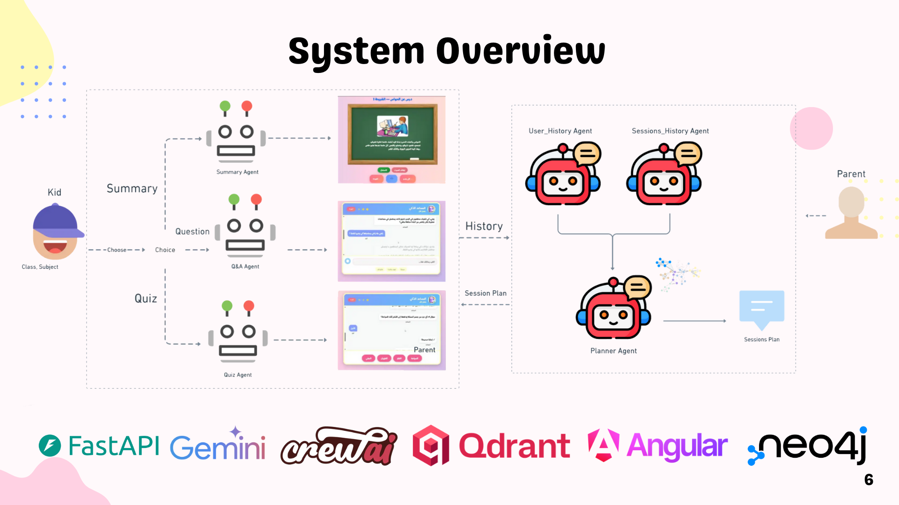

# Etude.AI – Multi-Agent Tunisian Educational Platform

Etude.AI is a **backend service** that uses multi-agent LLMs, a Neo4j knowledge graph, and a Qdrant vector store to support primary-school students (in Arabic/Tunisian dialect) with:

- **Lesson summaries**
- **Question answering**
- **Auto-generated quizzes**
- **PDF session reports for parents**

This repo contains **only the backend, data pipelines, and planner logic** – not the frontend UI.

---

## System Overview



The system is built around several agents and a small amount of session memory:

- **Summary Agent** – Generates a structured JSON “lesson script” (slides + optional images) from the book’s knowledge graph.  
  - Implemented in: `app/crew/agents.py` → `summary`  
  - Used by: `generate_summary_json` in `app/handlers.py`, exposed via `POST /summary` in `app/app.py`.

- **Q&A Agent** – Answers free-form questions from the student, using Qdrant + KG as context and a chat memory buffer.
  - Implemented in: `app/crew/agents.py` → `qa`  
  - Used by: `handle_qa` in `app/handlers.py`, exposed via `POST /qa`.

- **Quiz Agent** – Creates multiple-choice and true/false questions for a given topic and returns them as JSON.
  - Implemented in: `app/crew/agents.py` → `quiz`  
  - Used by: `generate_quiz_json` in `app/handlers.py`, exposed via `POST /quiz`.

- **Feedback Agent** – Reads the stored session data and writes a short encouraging note in Tunisian dialect.
  - Implemented in: `app/crew/agents.py` → `feedback`  
  - Used inside: `POST /report` in `app/app.py` to include the note in the PDF.

- **Session Memory** – Very light in-memory store (`SessionMemory` in `app/pdf_report.py`) wrapped as `GLOBAL_MEM` in `app/runtime.py`.  
  - Logs: summaries, Q&A history, quiz logs, feedback note, etc. for the current session.

The LLM used everywhere is Gemini (`gemini/gemini-2.0-flash`), configured in `app/crew/agents.py` and `app/crew/planner_crew.py`.

---

## Knowledge Graph & Retrieval


The educational content is built from a Tunisian science textbook and stored in two main backends: **Neo4j** and **Qdrant**.

### 1. PDF / Content Processing

Located in `databases_construction/`:

- `ocr_pdf.py`  
  - Extracts text and images from `config_files/Book.pdf` (via PyMuPDF / OCR).
  - Saves images into `config_files/book_images/`.

- `kg_construction.py`  
  - Defines a nested Python dict for branches → topics → lessons and page ranges.  
  - Writes this structure into **Neo4j** as:
    - `(:Book) -[:HAS_BRANCH]-> (:Branch)`
    - `(:Branch) -[:HAS_TOPIC]-> (:Topic)`
    - `(:Topic) -[:HAS_LESSON]-> (:Lesson)`
  - Optionally adds `(:Image)` nodes from the captions CSV and links them to lessons.
  - Computes and stores **Arabic sentence embeddings** for lessons (SBERT / HuggingFace, see imports in the file).

- `Qdrant_database_construction.py`  
  - Reads preprocessed chunks (e.g., from `config_files/ktebjson/Book.pdf.json`).  
  - Uses Gemini `"text-embedding-004"` to embed them (`embed()` inside the file).  
  - Creates / recreates the **Qdrant** collection `etudeai` and upserts points with payloads like: topic, lesson, page, text.

### 2. Runtime Retrieval

- `app/crew/knowledge_graph.py`  
  - Wraps Neo4j in `Neo4jKG`, providing:
    - `get_lessons_for_topic(topic_name)` – list of lessons + page ranges
    - `find_branch_for_topic(topic_name)` – map topic → branch
    - `fetch_all_topics()`, `fetch_all_lesson_embeddings()`, etc.

- `app/crew/tools.py`  
  - Defines `LessonRetrieverTool`, a CrewAI `BaseTool` calling `Neo4jKG.get_lessons_for_topic`.

- `app/runtime.py`  
  - Creates `TOOL = QdrantVectorSearchTool(...)` using env vars:
    - `QDRANT_URL`
    - `QDRANT_API_KEY`
    - collection `etudeai`
  - Passes this tool into `define_agents()` so **Summary / QA / Quiz** agents can retrieve semantically similar content.

---

## Planner & History Agents (Right Side of the Slide)

The planner part of your diagram is implemented in **`app/crew/planner_crew.py`** with configuration in `app/crew/config/agents.yaml` and `app/crew/config/tasks.yaml`.

### PlannerCrew

`PlannerCrew` (decorated with `@CrewBase`) wires together three agents and three tasks:

- **Agents** (`agents.yaml`):
  - `planner_agent` – “Session Management Agent”  
    - Role: propose a structured plan of sessions, using the knowledge graph through `lesson_retriever_tool`.  
  - `sessions_history_agent` – “Session History Summarizer”  
    - Role: summarize the JSON logs of past sessions.  
    - Data source: `get_sessions_logs()` from `app/handlers.py`, passed as a string knowledge source.  
  - `user_history_agent` – “User History Summarizer”  
    - Role: summarize long-term user profile and progress (strengths/weaknesses).  
    - Data source: `get_user_logs()` from `app/handlers.py`, also via `StringKnowledgeSource`.

- **Tasks** (`tasks.yaml`):
  - `sessions_history_task` – summarize past sessions in Arabic for the parent.  
  - `user_history_task` – summarize overall learning history and recommendations.  
  - `plan_task` – generate a **weekly JSON session plan** (branch, topic, lesson, date, obstacles, session_goal, parent_tip, etc.).

- **Crew entry point**:
  - `app/crew/run.py`:
    ```python
    from app.crew.planner_crew import PlannerCrew
    from app.handlers import get_parent_choices

    def run():
        inputs = get_parent_choices()
        result = PlannerCrew().crew().kickoff(inputs=inputs)
        print(result)
    ```

So the **“Planner Agent + User History Agent + Sessions History Agent”** shown on your slide are implemented exactly here.

---

## API Layer (FastAPI)

All HTTP endpoints live in `app/app.py`:

- `GET /health` – simple health check.
- `POST /summary`  
  - Body: `{ "module": "<topic name in Arabic>" }`  
  - Uses: `generate_summary_json()` → Summary agent + Neo4j KG.  
  - Saves JSON lesson script to `lessons/` directory and logs to `GLOBAL_MEM`.

- `POST /qa`  
  - Body: `{ "question": "<student question>" }`  
  - Uses: `handle_qa()` → QA agent + Qdrant + `ConversationBufferMemory`.  
  - Stores turn history in `QA_MEMORY` and appends to `GLOBAL_MEM["qa_history"]`.

- `POST /quiz`  
  - Body: `{ "module": "...", "num_mc": 6, "num_tf": 4 }`  
  - Uses: `generate_quiz_json()` → Quiz agent.  
  - Logs questions into `GLOBAL_MEM["quiz_log"]`.

- `POST /report`  
  - Reads what is stored in `GLOBAL_MEM`:
    - Chapter summaries
    - Q&A pairs
    - Quiz results  
  - Builds a multi-section Arabic prompt, calls the **Feedback Agent** to write a short note in Tunisian dialect.  
  - Calls `render_pdf()` from `app/pdf_report.py` to generate a **session report PDF** into `reports/session_report.pdf`.

Static routes:

- `/lessons` – serves JSON lesson scripts saved in `lessons/`.
- `/reports` – serves generated PDFs from `reports/`.

### PDF Rendering

- Implemented in `app/pdf_report.py`:
  - Uses ReportLab + Pillow.
  - Handles Arabic correctly with:
    - `ARABIC_FONT_NAME` & `NotoNaskhArabic-Regular.ttf` from `config_files/`.
    - `rtl()` and `strip_unsupported()` helpers from `app/helpers.py`.
  - Can also render images referenced by markdown-style `` tags using `config_files/book_images`.

---

## Project Structure

```text
Multi-Agent-Tunisian-Educational-Plateform-main/
├── app/
│   ├── app.py                # FastAPI app + HTTP endpoints
│   ├── handlers.py           # Summary / QA / Quiz orchestration, logs for planner
│   ├── helpers.py            # Gemini embedding helper, JSON cleaning, Arabic RTL utilities
│   ├── pdf_report.py         # SessionMemory + ReportLab PDF generation
│   ├── runtime.py            # Qdrant tool, shared LLM, global agents & GLOBAL_MEM
│   └── crew/
│       ├── agents.py         # Summary, QA, Quiz, Feedback agents (Gemini)
│       ├── planner_crew.py   # PlannerCrew + user/sessions history + planner agent
│       ├── run.py            # Small CLI runner for PlannerCrew
│       ├── tasks.py          # Prompt templates for summary, QA, quiz
│       ├── tools.py          # LessonRetrieverTool wrapping Neo4jKG
│       ├── knowledge_graph.py# Thin Neo4j client with helper queries
│       └── config/
│           ├── agents.yaml   # Config for planner_agent, sessions_history_agent, user_history_agent
│           └── tasks.yaml    # Config for plan_task, sessions_history_task, user_history_task
├── config_files/
│   ├── Book.pdf              # Original science textbook
│   ├── NotoNaskhArabic-Regular.ttf
│   ├── book_images/          # Extracted images
│   ├── captions_ar (1).csv   # Image captions in Arabic
│   └── ktebjson/
│       └── Book.pdf.json     # Page-level text chunks used in indexing
├── databases_construction/
│   ├── ocr_pdf.py            # Extract text + images from the PDF
│   ├── kg_construction.py    # Build Neo4j knowledge graph + lesson embeddings
│   └── Qdrant_database_construction.py  # Build Qdrant "etudeai" collection
├── lessons/                  # Auto-generated JSON lesson scripts from /summary
├── main.py                   # Dev entrypoint: starts FastAPI with Uvicorn + ngrok
├── session_report.pdf        # Example generated report
├── 6.png                     # System overview diagram
└── 7.png                     # Knowledge graph construction diagram
